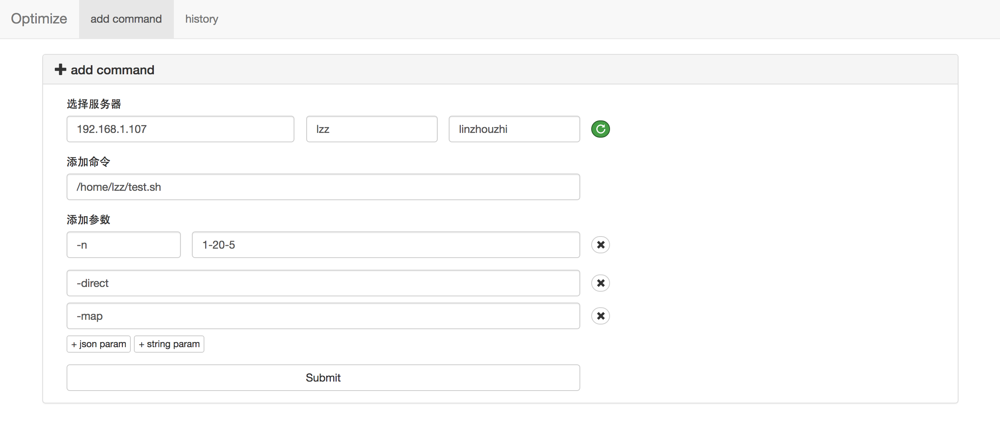
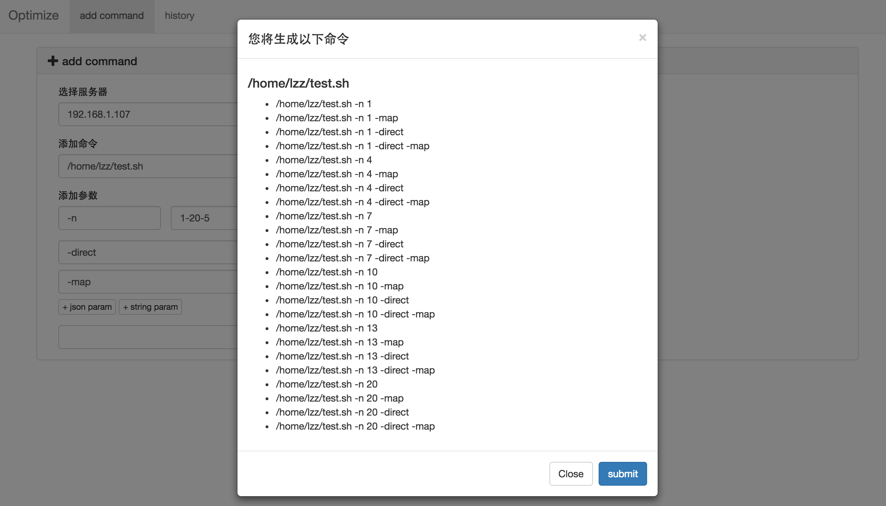
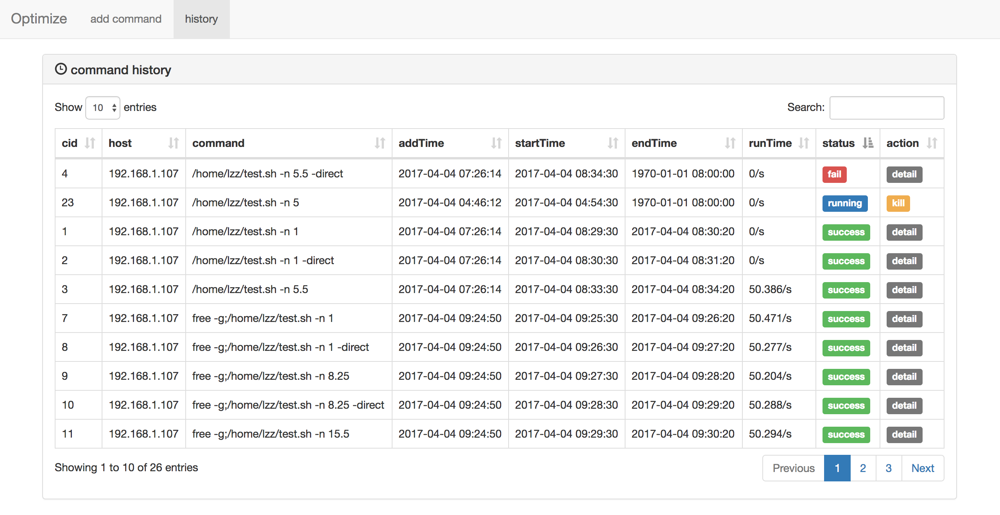

# Optimize
> 客户端参数调优工具,自动找出命令参数的最优组合

## 一、介绍

我们在使用 sparkSql sqoop datax 甚至机器学习算法的时候，需要在找最优参数组合的过程中浪费很多时间。
比如，sparkSql 可以配置driver-memory num-executor 假设每一种类型都有十种可以设置的类型，那么将产生 10*10 也就是一百种的参数组合。如下   
    sparksql  --driver-memory 2G  --num-executors 3   
    sparksql  --driver-memory 2G  --num-executors 4   
    sparksql  --driver-memory 4G  --num-executors 3   
    ...   
    sqoop 格式也是 sqoop --direct  -m 10 等等...   
Optimize 就是为了解决这个问题而设计的，它自动生成参数的组合，并远程执行统计执行时间，这样就可以很方便的找到最优的参数组合了，这对我们工具的优化，或着技术的选型有很大的帮助，比如我们对比 sqoop 和 datax 的倒入效率对比需要设置各种情况的参数，有了 Optimeze 就可以很容易分析出两种工具最佳状态下的性能了。

## 二、安装    
* 1、npm install express --save //web 框架
* 2、npm install body-parser --save
* 3、npm install cookie-parser --save
* 4、npm install multer --save
* 5、npm install ejs --save //前端模版引擎
* 6、npm install simple-ssh --save  // 执行命令通过ssh
* 7、npm install --save better-sqlite3 (python2.7) // 数据保存在 sqlite
* 8、npm install moment // 前端时间模版格式化
* node app.js
* http://127.0.0.1:8081/command/add
json param:  -n  1-4-2
string param: -direct

## 三、使用
> 包含了如何 添加命令、预览命令、命令历史

### 1、添加命令
* 配置服务器，ssh  host username password
* 添加命令 username 身份对应的 host 机器命令（就是我们要执行的）
* json param 这是 json 类型的数据比如 （sqoop --direct  -m 10） 可以配置 －m 1-20-4 表示m 最小是1 最大是20分为4份处理
* string param 这个是字符串类型的 比如 （sqoop --direct  -m 10） direct 就可以直接填  --direct
具体如图：

### 2、预览命令
>  预览生成的命令就可以在历史界面查看了

### 3、历史命令
>  查看历史命令，您可以进行删除，kill,查看详情等操作

